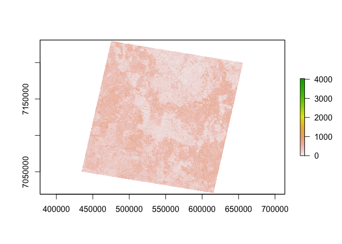
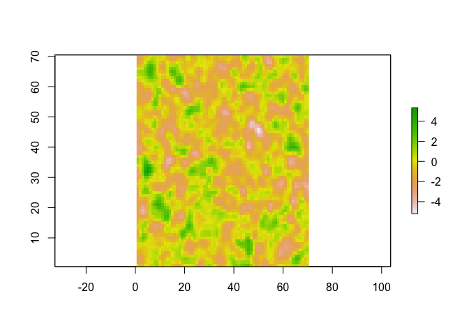
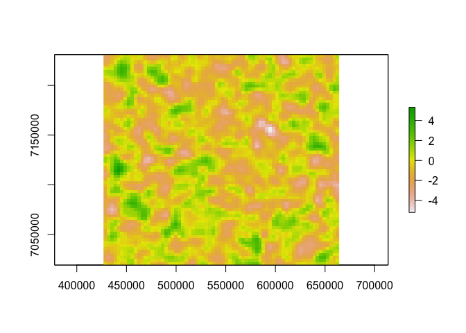

<!-- README.md is generated from README.Rmd. Please edit that file -->

# nimbus

<!-- badges: start -->

[](https://github.com/jonotuke/nimbus/actions/workflows/R-CMD-check.yaml)
<!-- badges: end -->

The goal of nimbus is to simulate cloud cover and add it to raster
files.

## Installation

You can install the development version of nimbus from
[GitHub](https://github.com/) with:

``` r
# install.packages("devtools")
devtools::install_github("jonotuke/nimbus")
```

## Example

First we load the package.

``` r
library(nimbus)
## basic example code
```

We will illustrate by adding a cloud cover to the example raster. First
we look at the example raster

``` r
library(raster)
#> Loading required package: sp
plot(example_raster)
```



We will simulate a $70 \times 70$ pixels cloud

``` r
cloud <- simulate_cloud(phi = 0.1, seed = 2023)
```

``` r
plot(cloud)
```



Next, we will match the extent and projection of the simulated cloud
raster with the original raster.

``` r
cloud <- match_rasters(example_raster, cloud)
plot(cloud)
```


