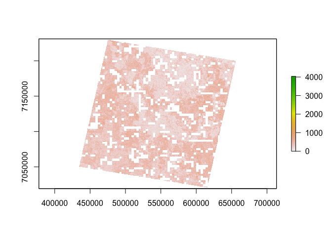

<!-- README.md is generated from README.Rmd. Please edit that file -->

# nimbus

<!-- badges: start -->

[](https://github.com/jonotuke/nimbus/actions/workflows/R-CMD-check.yaml)
<!-- badges: end -->

The goal of nimbus is to simulate cloud cover and add it to raster
files.

## Installation

You can install the development version of nimbus from
[GitHub](https://github.com/) with:

``` r
# install.packages("devtools")
devtools::install_github("jonotuke/nimbus")
```

## Example

First we load the package.

``` r
library(nimbus)
library(raster)
#> Loading required package: sp
## basic example code
```

We will illustrate by adding a cloud cover to the example raster. First
we look at the example raster

``` r
plot(example_raster)
```


We will simulate a $70 \times 70$ pixels cloud

``` r
cloud <- simulate_cloud(phi = 0.1, seed = 2023)
```

``` r
plot(cloud)
```


Next, we will match the extent and projection of the simulated cloud
raster with the original raster.

``` r
cloud <- match_rasters(example_raster, cloud)
plot(cloud)
```


``` r
cloud
#> class      : RasterLayer 
#> dimensions : 7061, 7911, 55859571  (nrow, ncol, ncell)
#> resolution : 30, 30  (x, y)
#> extent     : 426885, 664215, 7019185, 7231015  (xmin, xmax, ymin, ymax)
#> crs        : +proj=utm +zone=55 +south +datum=WGS84 +units=m +no_defs 
#> source     : memory
#> names      : Z 
#> values     : -5.199408, 5.321076  (min, max)
```

Now, we will filter the cloud and convert values to NAs that will add
ask masks in the next stage.

``` r
speckled_cloud <- filter_cloud(cloud)
large_cloud <- filter_cloud(cloud, type = "large")
```

``` r
plot(speckled_cloud)
```


``` r
plot(large_cloud)
```


Finally, we can now add the clouds to the original raster

``` r
example_raster |> add_cloud(speckled_cloud) |> plot()
```



``` r
example_raster |> add_cloud(large_cloud) |> plot()
```


